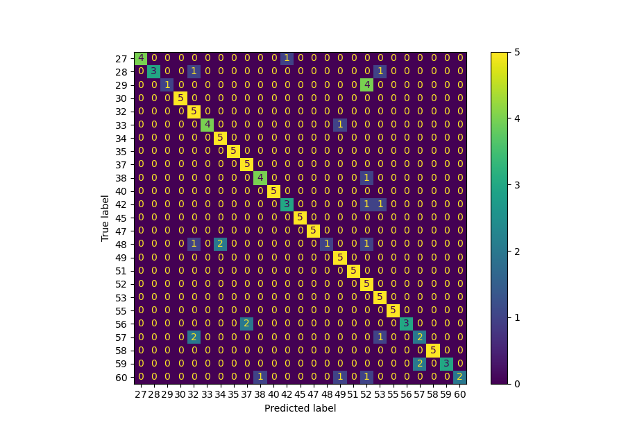

# Speaker Identification 

## Background
The King corpus is comprised of 51 male speakers recorded by The International Telephone Corporation in San Diego, CA and Nutley, NJ. 

Most speakers have 10 recording sessions if a speaker has less than 10 we claim the speaker does not have enough samples to be identified and remove them from the experiment. 

There are two versions of this corpus, a high fidelity one that is sampled at 16 kHz referred to as the wide-band corpus, and speech that has been transmitted through a public telephone network and samples at 8 kHz; the narrow-band corpus. 

For this experiment we only work with the 25 wide-band samples from the 25 Nutley, NJ speakers. 

## Training
Spectragrams are dervied from the first 5 recordings of each of the 25 speaers, with a 10 ms advance and a 20 ms length. 

A Gaussian mixture model is used to identify areas of speech activity and noise. The mean noise of each frequency of the spectrogram is computed from the noise frames and subtracted from all frames. Noise frames are discarded and we are left with a speech-only spectrogram. 

Neural Networks are built using a a 90/10 training/validation and area kept shallow depth due to limited data. 

## Experiments
|Model|Error Rate|
| ------------- |-------------|
|Base Model|40%|
|Narrowing Nodes Model|60%|
|Wide Model|16%|
|Intermittant Dropout Model|~|
|Convolutional Model|~|

### Best Performing Model
Narrowing Nodes

 

## Credit
Higgins, A. and Vermilyea, D. (1995). King Speaker Verification, (ed. I. T. a. T. Corporation). 3600 Market Street, Suite 810, Philadelphia, PA 19104-2653: Linguistic Data Consortium. 